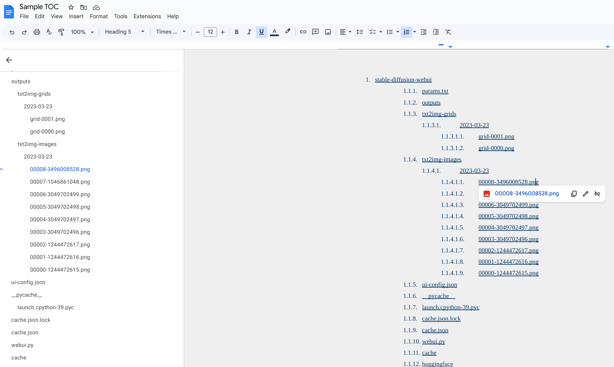

# Description
Google Drive uses a traditional folder and sub-folder structure for document storage, lacking manual reordering or hierarchy creation.
I developed a script to auto-generate a TOC (table of contents) to solve this weakness based on a given folder. It will create a TOC and upload it into a given Google Docs.

# Step 1: Setting up OAuth 2.0 for Google Drive
Please follow [these steps](https://support.google.com/cloud/answer/6158849), download the credential file, rename it to credentials.json, and put it in the app root folder.

# Step 2: Install dependencies
```
pip3 install --upgrade google-api-python-client google-auth-httplib2 google-auth-oauthlib

pip3 install gdata
```
# Step 3: update config
You can open config.ini, put the Google Dolder ID that you want to generate the TOC, and a Google Docs ID to store the TOC.
```
[DEFAULT]
toc_document_id = <google docs id to store the toc>
root_folder_id = <grive folder id>
```

# Step 4: Run
```
python3 generate.py
```

# Ta da

